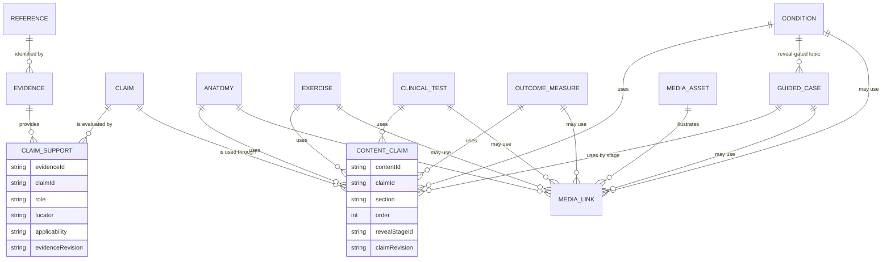
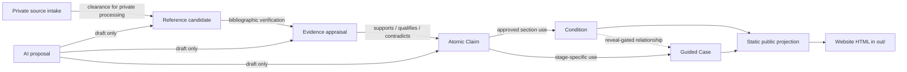
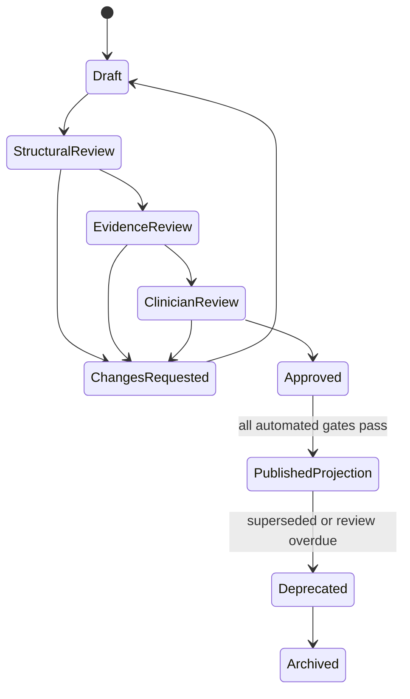
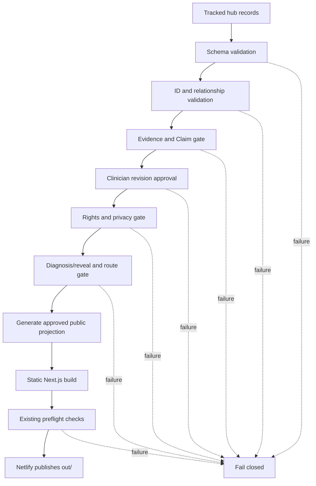

# Evidence Hub v1 Architecture

Status: proposed architecture only

Decision state: pending technical, information-governance, and clinician review

Runtime impact: none

Public content impact: none

## 1. Purpose And Scope

Evidence Hub v1 is a proposed, review-first content graph for the MSK Clinical
Reasoning Lab. It separates source provenance, evidence appraisal, clinical
claims, learning resources, and public presentation so that each can be
reviewed and versioned independently.

The hub is not a runtime database, public API, clinical decision-support
system, or autonomous publishing service. Version 1 should be implemented as
validated, deterministic repository data. The existing static Next.js build
remains the only public delivery mechanism, and `ai-manager/` remains a private
local proposal and ingestion environment.

This specification introduces no clinical assertions. It defines containers
and gates for assertions that are supplied and approved later.

### 1.1 Goals

- Give every public clinical claim explicit evidence and review provenance.
- Reuse claims across conditions, anatomy, tests, exercises, cases, and learning
  modes without copying untraceable prose.
- Preserve the current source-intake pipeline and its checksum-scoped clearance
  decisions.
- Let the local AI manager propose records without granting approval.
- Keep publication deterministic, static, auditable, and fail-closed.
- Support incremental migration from existing MDX without changing current
  routes or learner behavior.

### 1.2 Non-goals

- Replacing the public MDX renderer in v1.
- Storing patient information or learner answers.
- Live evidence lookup, vector search, or runtime AI.
- Automatically judging clinical correctness or evidence quality.
- Automatically converting extracted citations into verified references.
- Publishing private intake sources or copyrighted source bodies.

## 2. Governing Principles

1. **Stable identity:** every hub record has a namespaced, immutable ID.
2. **Three separate gates:** lifecycle, review state, and public eligibility are
   distinct fields and never inferred from one another.
3. **Evidence is not a reference:** a reference identifies a work; an Evidence
   record documents what was appraised, where, how, and with what limitations.
4. **Claims are atomic:** clinical assertions are reusable records with explicit
   support, contradiction, applicability, and approval.
5. **Teaching sources are not clinical authority:** source intake or private
   evidence clearance allows processing, not clinical approval or publication.
6. **No defaults to public:** missing status, review, provenance, rights, or
   relationship validation makes a record ineligible.
7. **Immutable provenance:** source IDs, exact-byte checksums, locators, and
   prior revisions remain auditable.
8. **Static projection:** the public site consumes a generated, reviewed subset;
   it does not query the private hub or AI manager at runtime.
9. **Human separation of duties:** AI may draft, a reviewer may verify structure
   and provenance, and an authorised clinician approves clinical meaning.
10. **Git remains the audit trail:** approved record changes are reviewable diffs.

## 3. Terminology And State Model

### 3.1 Shared identifiers

IDs use the existing namespaced lowercase convention:

| Entity | Pattern | Example shape |
|---|---|---|
| Evidence | `evidence.<domain>.<slug>` | `evidence.shoulder.example-review` |
| Claim | `claim.<domain>.<slug>` | `claim.shoulder.example-claim` |
| Condition | `condition.<region>.<slug>` | `condition.shoulder.example` |
| Anatomy | `anatomy.<category>.<slug>` | `anatomy.nerve.example` |
| Exercise | `exercise.<region>.<slug>` | `exercise.shoulder.example` |
| Clinical Test | `test.<region>.<slug>` | `test.shoulder.example` |
| Outcome Measure | `outcome.<slug>` | `outcome.example-measure` |
| Guided Case | `case.<region>.<neutral-id>` | `case.shoulder.case-01` |
| Reference | `reference.<scheme>.<slug>` | `reference.doi.example` |
| Media Asset | `media.<category>.<slug>` | `media.diagram.example` |

Examples show syntax only and are not proposed clinical records.

IDs never encode mutable titles, review status, or version numbers. Existing
IDs and slugs are retained as aliases during migration.

### 3.2 Independent state axes

```text
lifecycleStatus: draft | active | deprecated | archived
reviewStatus: unreviewed | structural-review | evidence-review |
              clinician-review | approved | changes-requested
publicEligibility: false | true
```

`publicEligibility: true` is valid only when all entity-specific gates pass.
No field defaults to `true`, `active`, or `approved`.

### 3.3 Common record envelope

All entities share:

- `schemaVersion`
- `id`
- `entityType`
- `revision`
- `lifecycleStatus`
- `reviewStatus`
- `publicEligibility`
- `createdAt`
- `updatedAt`
- `provenance`
- `supersedesRevision`
- `changeSummary`

Dates record governed decisions or authored revisions. Generators must not add
non-deterministic timestamps to committed output.

## 4. Core Entities

The fields below are the v1 domain contract. Fields marked as optional remain
subject to stricter entity-specific publication requirements.

### 4.1 Evidence

**Purpose:** Records the appraisal and usable scope of a source or source set.
It is the governed bridge between private intake/reference identity and Claims.

**Required fields**

- Common record envelope.
- `title`.
- `evidenceType`: guideline, systematic-review, randomised-trial,
  diagnostic-study, prognostic-study, observational-study, consensus,
  textbook, teaching-source, patient-information, or other.
- `referenceIds`: one or more canonical Reference IDs, except a private draft
  may temporarily use governed `sourceLocators` only.
- `sourceLocators`: source ID, checksum, page/slide/section locator, and
  clearance scope.
- `verificationStatus`: extracted-unverified, bibliographic-verified,
  full-text-reviewed, or unable-to-verify.
- `appraisalStatus`: not-appraised, appraisal-in-progress, appraised, or
  appraisal-outdated.
- `applicability` and `limitations`, each explicitly present even if pending.

**Optional fields**

- `studyDesign`, `population`, `setting`, `intervention`, `comparator`,
  `outcomes`, `effectSummary`, `qualityFramework`, `qualityAssessment`,
  `evidenceHierarchyRank`, `supersededByEvidenceIds`, and `notes`.

**Lifecycle:** draft after ingestion; active after bibliographic/evidence review;
deprecated when superseded or no longer applicable; archived when retained only
for audit.

**Governance:** private source clearance permits processing only. Public use
requires every source locator to carry explicit `public-evidence-use` scope,
verified Reference identity, reviewed locators, completed limitations, evidence
review, and no restricted/private source leakage. Evidence review does not
itself approve any clinical Claim.

**Relationships:** cites References; supports, contradicts, qualifies, or
contextualises Claims; may be derived from private source-intake records.

### 4.2 Claim

**Purpose:** Stores one atomic, reviewable clinical, educational, safety, or
descriptive statement that other records may use.

**Required fields**

- Common record envelope.
- `statement`.
- `claimType`: definition, epidemiology, presentation, assessment,
  diagnostic-accuracy, prognosis, safety, management, communication, anatomy,
  measurement-property, or educational.
- `scope`: population, setting, region, and applicability qualifiers.
- `support`: Evidence relationship records with role and locator.
- `strength`: pending, limited, moderate, strong, consensus-only, or not-rated.
- `limitations`.
- `clinicalReviewRequired`.

**Optional fields**

- `contradictingEvidenceIds`, `qualifyingEvidenceIds`, `parentClaimId`,
  `relatedClaimIds`, `validFrom`, `reviewDue`, and `wordingNotes`.

**Lifecycle:** draft; active after applicable review; deprecated when replaced;
archived for audit. A replacement creates a new revision or Claim ID depending
on whether meaning changes materially.

**Governance:** public clinical Claims require at least one eligible Evidence
link, evidence review, clinician approval of the exact statement revision, and
completed limitations. A Claim with conflicting evidence may be approved only
when the conflict and uncertainty are represented explicitly.

**Relationships:** supported/qualified/contradicted by Evidence; used by
Conditions, Anatomy, Exercises, Clinical Tests, Outcome Measures, Guided Cases,
and later learning records.

### 4.3 Condition

**Purpose:** Represents the structured clinical reference topic currently
rendered from condition MDX.

**Required fields**

- Common record envelope.
- `title`, `slug`, and `region`.
- `sectionClaims`: map of section key to ordered Claim IDs.
- `reviewSummary`: last reviewed revision and review-due state.

**Optional fields**

- `codes`, `synonyms`, `tags`, `relatedConditionIds`, `anatomyIds`,
  `exerciseIds`, `clinicalTestIds`, `outcomeMeasureIds`, `guidedCaseIds`,
  `mediaAssetIds`, `referencesForFurtherReading`, and MDX presentation fields.

**Lifecycle:** draft/private while incomplete; active and public after current
condition gates; deprecated/archived without deleting prior IDs.

**Governance:** diagnostic names are allowed in the reference library. Every
public clinical section must resolve to approved Claims or be explicitly marked
as non-clinical navigation/presentation text. Matching unrevealed cases cannot
be linked from the condition page.

**Relationships:** uses Claims; relates to Anatomy, Exercises, Clinical Tests,
Outcome Measures, Media Assets, Conditions, and reveal-gated Guided Cases.

### 4.4 Anatomy

**Purpose:** Represents a governed anatomical structure or functional anatomy
topic using the existing discriminated anatomy categories.

**Required fields**

- Common record envelope.
- `title`, `slug`, `category`, and `regions`.
- `claimIds` for clinically meaningful descriptions.

**Optional fields**

- Category-specific properties such as `originClaimIds`, `insertionClaimIds`,
  `innervationClaimIds`, `functionClaimIds`, `courseClaimIds`,
  `relationshipIds`, `examinationClaimIds`, `conditionIds`, `caseIds`, and
  `mediaAssetIds`.

**Lifecycle:** draft/private until evidence, review, and media rights gates pass;
then active; later deprecated or archived.

**Governance:** anatomical facts and clinical relevance require clinician or
appropriately qualified subject review. Unknown media provenance blocks the
asset and any presentation that depends on it, not necessarily the text record.

**Relationships:** uses Claims; links to Conditions, Clinical Tests, Exercises,
Guided Cases, other Anatomy records, and Media Assets.

### 4.5 Exercise

**Purpose:** Represents a reusable rehabilitation activity without treating it
as a universal prescription.

**Required fields**

- Common record envelope.
- `title`, `slug`, `regions`, and `purposeClaimIds`.
- `instructionClaimIds` and `safetyClaimIds`.
- `dosageStatus`: individualise, protocol-linked, or not-specified.

**Optional fields**

- `equipment`, `position`, `progressionClaimIds`, `regressionClaimIds`,
  `dosageClaimIds`, `contraindicationClaimIds`, `conditionIds`, `caseIds`, and
  `mediaAssetIds`.

**Lifecycle:** draft/private; active after instruction, safety, evidence, media,
and clinician review; deprecated/archived when replaced.

**Governance:** dosage, precautions, progression, and suitability must be
Claim-backed. Missing dosage is represented as not specified, never inferred.
No Exercise record is patient-specific advice.

**Relationships:** uses Claims; relates to Conditions, Anatomy, Guided Cases,
Outcome Measures, and Media Assets.

### 4.6 Clinical Test

**Purpose:** Represents an examination procedure or test cluster and its
interpretation limits.

**Required fields**

- Common record envelope.
- `title`, `slug`, `regions`, and `testKind`.
- `purposeClaimIds`, `techniqueClaimIds`, `interpretationClaimIds`, and
  `limitationClaimIds`.

**Optional fields**

- `cautionClaimIds`, `diagnosticAccuracyClaimIds`, `clusterMemberIds`,
  `conditionIds`, `anatomyIds`, `caseIds`, and `mediaAssetIds`.

**Lifecycle:** draft/private; active after technique, interpretation,
limitations, and clinical review; deprecated or archived when superseded.

**Governance:** diagnostic values must be exact Claim revisions linked to
eligible Evidence with applicable population/context. Tests cannot be presented
as independently diagnostic unless an approved Claim explicitly supports that
wording.

**Relationships:** uses Claims; relates to Conditions, Anatomy, Guided Cases,
other Clinical Tests, and Media Assets.

### 4.7 Outcome Measure

**Purpose:** Represents a measurement instrument, scoring method, interpretation,
and use restrictions.

**Required fields**

- Common record envelope.
- `title`, `slug`, `constructClaimIds`, `populationClaimIds`, and
  `scoringClaimIds`.
- `licenceStatus`: unknown, review-required, approved-for-described-use, or
  restricted.

**Optional fields**

- `abbreviation`, `interpretationClaimIds`, `measurementPropertyClaimIds`,
  `mcidClaimIds`, `mdcClaimIds`, `conditionIds`, `caseIds`, `exerciseIds`,
  `formMediaAssetId`, and `externalAccessUrl`.

**Lifecycle:** draft/private until scoring and rights are reviewed; active when
approved for its described use; deprecated/archived when superseded.

**Governance:** MCID/MDC and measurement properties must be population-specific
Claims. Unknown or restrictive licences block reproduction of the instrument;
metadata may remain private or link externally when approved.

**Relationships:** uses Claims; relates to Conditions, Exercises, Guided Cases,
References, and governed Media Assets.

### 4.8 Guided Case

**Purpose:** Represents a staged clinical-reasoning experience while preserving
neutral discovery and diagnosis hiding.

**Required fields**

- Common record envelope.
- `internalTitle`, `neutralTitle`, `neutralPublicSlug`, and `region`.
- `linkedConditionId` stored internally.
- ordered `stages`, each with stable stage ID, type, prompt, and Claim IDs.
- `diagnosisRevealStageId`.
- explicit publication status compatible with the existing case gate.

**Optional fields**

- `anatomyIds`, `exerciseIds`, `clinicalTestIds`, `outcomeMeasureIds`,
  `mediaAssetIds`, `learningModeIds`, `estimatedTime`, and difficulty metadata.

**Lifecycle:** draft/private while authored and reviewed; active/public only
after current route, source, reveal, diagnosis no-leak, and clinical gates;
deprecated/archived while routes remain controlled.

**Governance:** all diagnosis-bearing Claims and matching Condition links are
assigned to the reveal stage or later. Pre-reveal stages may use only Claims
approved as diagnosis-neutral for that case. Cases cannot infer approval from
their linked Condition.

**Relationships:** uses Claims; references a Condition only behind the reveal
gate; may use Anatomy, Exercises, Tests, Outcome Measures, and Media Assets.

### 4.9 Reference

**Purpose:** Holds canonical bibliographic identity and verification history.
It does not assert that the work supports a Claim.

**Required fields**

- Common record envelope, always with `publicEligibility: false` until
  bibliographic verification and rights-safe display checks pass.
- `citationAsPresented`.
- `referenceType`.
- `verificationStatus`.
- `sourceProvenance`: source ID, checksum, and locator for extracted candidates.

**Optional fields**

- `authors`, `year`, `title`, `journalOrPublisher`, `volume`, `issue`, `pages`,
  `doi`, `pmid`, `url`, `isbn`, `duplicateGroupId`, `canonicalReferenceId`,
  `context`, and `verificationEvidence`.

**Lifecycle:** candidate; verified; superseded/merged; deprecated; archived.
Candidate intake records are promoted rather than overwritten.

**Governance:** missing fields are never invented. Identifier presence is not
verification. Merges retain aliases and all original source locators. Reference
verification is separate from evidence appraisal and clinician approval.

**Relationships:** cited by Evidence; may be listed as further reading by other
entities without being treated as Claim support.

### 4.10 Media Asset

**Purpose:** Governs images, diagrams, audio, video, documents, and future 3D or
imaging assets independently from clinical records.

**Required fields**

- Common record envelope.
- `title`, `assetType`, `checksum`, `storageClass`, and `sourceProvenance`.
- `rightsStatus`, `attribution`, `accessibilityStatus`, and `reviewStatus`.
- `publicPath` only when approved for public use.

**Optional fields**

- `creator`, `licence`, `licenceUrl`, `modificationHistory`, `altText`,
  `transcript`, `caption`, `dimensions`, `duration`, `mimeType`, `thumbnailId`,
  `relatedContentIds`, and `clinicalAnnotationClaimIds`.

**Lifecycle:** quarantined/private; rights-review; accessible-review; approved;
deprecated/archived.

**Governance:** unknown provenance, rights, or accessibility sets public
eligibility false. Private source media and unapproved GLB assets never enter
`public/`, `src/app/`, search, or `out/`. Clinical annotations require Claim and
clinician review.

**Relationships:** illustrates any content entity; may use Claims for clinical
annotations; can reference another Media Asset as a derivative.

## 5. Relationship Model

Relations are first-class records so role, order, reveal stage, applicability,
and revision can be validated. Arrays of IDs remain acceptable as generated
projections, but the relation record is authoritative.

### 5.1 ER diagram



### 5.2 Required evidence-to-website path



In plain terms:

```text
Evidence
  supports / qualifies / contradicts
Claims
  are used by
Conditions
  are referenced by reveal-gated
Guided Cases
  are projected into
the static website
```

A Guided Case may also use approved Claims directly. A Condition-to-case link
does not establish evidence support and must not disclose the diagnosis before
reveal.

### 5.3 Generic relationship record

```ts
type RelationshipRole =
  | 'supports'
  | 'contradicts'
  | 'qualifies'
  | 'uses'
  | 'illustrates'
  | 'measures'
  | 'assesses'
  | 'applies-to'
  | 'related-to'
  | 'supersedes'

interface HubRelationship {
  id: string
  fromId: string
  toId: string
  role: RelationshipRole
  fromRevision: number
  toRevision: number
  section?: string
  order?: number
  revealStageId?: string
  applicability?: string
  evidenceLocator?: string
  lifecycleStatus: 'draft' | 'active' | 'deprecated' | 'archived'
  reviewStatus: ReviewStatus
}
```

## 6. Proposed Repository Structure

This is a future target, not a request to move current files immediately.

```text
content/
  evidence-hub/
    evidence/
      *.json
    claims/
      *.json
    references/
      *.json
    anatomy/
      <category>/*.json
    exercises/
      *.json
    clinical-tests/
      *.json
    outcome-measures/
      *.json
    media-assets/
      *.json
    relationships/
      claim-support.json
      content-claims.json
      content-links.json
  <region>/
    <condition>.mdx              # retained public presentation source
  cases/
    <region>/*.mdx               # retained neutral guided cases

src/lib/evidence-hub/
  schemas.ts                     # shared Zod schemas
  read.ts                        # deterministic server/build-time readers
  graph.ts                       # relationship and reciprocal-link checks
  publication.ts                 # fail-closed public projection
  types.ts                       # inferred/exported types

scripts/evidence-hub/
  check-schema.mjs
  check-relationships.mjs
  check-publication.mjs
  build-public-projection.mjs
  migrate-current-content.mjs

public/generated/
  evidence-hub/                  # approved projection only, if needed

ai-manager/
  config/
  schemas/
  prompts/
  workflows/
  proposals/                     # ignored/private until approved
  reports/                       # governed, redacted reports only
  private-cache/                 # ignored source text and intermediate data

docs/architecture/
  evidence-hub-v1.md
```

Public code must never read `ai-manager/`. The projection builder reads tracked,
approved hub records and existing public MDX only. It fails if a relationship
points to a missing, private, unapproved, or incompatible revision.

## 7. JSON Schema Proposal

Implementation should use JSON Schema Draft 2020-12 as the interchange contract
and Zod as the executable TypeScript validation layer. Generated JSON Schema and
Zod must be checked for semantic parity.

The following is an abbreviated but structurally complete proposal. Entity
tables in Section 4 define the domain-specific optional fields omitted from the
compact schema.

```json
{
  "$schema": "https://json-schema.org/draft/2020-12/schema",
  "$id": "https://example.invalid/msk/evidence-hub/v1.schema.json",
  "title": "Evidence Hub v1 record",
  "oneOf": [
    { "$ref": "#/$defs/evidence" },
    { "$ref": "#/$defs/claim" },
    { "$ref": "#/$defs/condition" },
    { "$ref": "#/$defs/anatomy" },
    { "$ref": "#/$defs/exercise" },
    { "$ref": "#/$defs/clinicalTest" },
    { "$ref": "#/$defs/outcomeMeasure" },
    { "$ref": "#/$defs/guidedCase" },
    { "$ref": "#/$defs/reference" },
    { "$ref": "#/$defs/mediaAsset" }
  ],
  "$defs": {
    "id": { "type": "string", "pattern": "^[a-z][a-z0-9-]*(?:\\.[a-z0-9-]+)+$" },
    "status": { "enum": ["draft", "active", "deprecated", "archived"] },
    "review": { "enum": ["unreviewed", "structural-review", "evidence-review", "clinician-review", "approved", "changes-requested"] },
    "base": {
      "type": "object",
      "required": ["schemaVersion", "id", "entityType", "revision", "lifecycleStatus", "reviewStatus", "publicEligibility", "createdAt", "updatedAt", "provenance", "changeSummary"],
      "properties": {
        "schemaVersion": { "const": 1 },
        "id": { "$ref": "#/$defs/id" },
        "entityType": { "type": "string" },
        "revision": { "type": "integer", "minimum": 1 },
        "lifecycleStatus": { "$ref": "#/$defs/status" },
        "reviewStatus": { "$ref": "#/$defs/review" },
        "publicEligibility": { "type": "boolean" },
        "createdAt": { "type": "string", "format": "date" },
        "updatedAt": { "type": "string", "format": "date" },
        "provenance": { "type": "array", "items": { "$ref": "#/$defs/provenance" } },
        "supersedesRevision": { "type": ["integer", "null"], "minimum": 1 },
        "changeSummary": { "type": "string", "minLength": 1 }
      }
    },
    "provenance": {
      "type": "object",
      "required": ["sourceId", "checksum", "locationCategory"],
      "properties": {
        "sourceId": { "type": "string", "minLength": 1 },
        "checksum": { "type": "string", "pattern": "^sha256:[0-9a-f]{64}$" },
        "locator": { "type": ["string", "null"] },
        "locationCategory": { "enum": ["repository-reviewed-source", "approved-local-inbox", "approved-m365", "external-reference"] },
        "clearanceScope": { "type": "array", "items": { "type": "string" } }
      },
      "additionalProperties": false
    },
    "evidence": {
      "allOf": [
        { "$ref": "#/$defs/base" },
        {
          "properties": {
            "entityType": { "const": "evidence" },
            "title": { "type": "string", "minLength": 1 },
            "evidenceType": { "type": "string", "minLength": 1 },
            "referenceIds": { "type": "array", "items": { "$ref": "#/$defs/id" } },
            "sourceLocators": { "type": "array", "minItems": 1, "items": { "$ref": "#/$defs/provenance" } },
            "verificationStatus": { "enum": ["extracted-unverified", "bibliographic-verified", "full-text-reviewed", "unable-to-verify"] },
            "appraisalStatus": { "enum": ["not-appraised", "appraisal-in-progress", "appraised", "appraisal-outdated"] },
            "applicability": { "type": "string" },
            "limitations": { "type": "array", "items": { "type": "string" } }
          },
          "required": ["title", "evidenceType", "referenceIds", "sourceLocators", "verificationStatus", "appraisalStatus", "applicability", "limitations"]
        }
      ]
    },
    "claimSupport": {
      "type": "object",
      "required": ["evidenceId", "evidenceRevision", "role", "locator", "applicability"],
      "properties": {
        "evidenceId": { "$ref": "#/$defs/id" },
        "evidenceRevision": { "type": "integer", "minimum": 1 },
        "role": { "enum": ["supports", "contradicts", "qualifies", "contextualises"] },
        "locator": { "type": "string", "minLength": 1 },
        "applicability": { "type": "string", "minLength": 1 }
      },
      "additionalProperties": false
    },
    "claim": {
      "allOf": [
        { "$ref": "#/$defs/base" },
        {
          "properties": {
            "entityType": { "const": "claim" },
            "statement": { "type": "string", "minLength": 1 },
            "claimType": { "type": "string", "minLength": 1 },
            "scope": { "type": "object" },
            "support": { "type": "array", "items": { "$ref": "#/$defs/claimSupport" } },
            "strength": { "enum": ["pending", "limited", "moderate", "strong", "consensus-only", "not-rated"] },
            "limitations": { "type": "array", "items": { "type": "string" } },
            "clinicalReviewRequired": { "type": "boolean" }
          },
          "required": ["statement", "claimType", "scope", "support", "strength", "limitations", "clinicalReviewRequired"]
        }
      ]
    },
    "contentBase": {
      "allOf": [
        { "$ref": "#/$defs/base" },
        {
          "type": "object",
          "required": ["title", "slug", "claimIds"],
          "properties": {
            "title": { "type": "string", "minLength": 1 },
            "slug": { "type": "string", "pattern": "^[a-z0-9-]+$" },
            "claimIds": { "type": "array", "items": { "$ref": "#/$defs/id" } },
            "relatedContentIds": { "type": "array", "items": { "$ref": "#/$defs/id" } },
            "mediaAssetIds": { "type": "array", "items": { "$ref": "#/$defs/id" } }
          }
        }
      ]
    },
    "condition": { "allOf": [{ "$ref": "#/$defs/contentBase" }, { "properties": { "entityType": { "const": "condition" }, "region": { "type": "string" }, "sectionClaims": { "type": "object", "additionalProperties": { "type": "array", "items": { "$ref": "#/$defs/id" } } } }, "required": ["region", "sectionClaims"] }] },
    "anatomy": { "allOf": [{ "$ref": "#/$defs/contentBase" }, { "properties": { "entityType": { "const": "anatomy" }, "category": { "type": "string" }, "regions": { "type": "array", "items": { "type": "string" } } }, "required": ["category", "regions"] }] },
    "exercise": { "allOf": [{ "$ref": "#/$defs/contentBase" }, { "properties": { "entityType": { "const": "exercise" }, "dosageStatus": { "enum": ["individualise", "protocol-linked", "not-specified"] } }, "required": ["dosageStatus"] }] },
    "clinicalTest": { "allOf": [{ "$ref": "#/$defs/contentBase" }, { "properties": { "entityType": { "const": "clinical-test" }, "testKind": { "type": "string" } }, "required": ["testKind"] }] },
    "outcomeMeasure": { "allOf": [{ "$ref": "#/$defs/contentBase" }, { "properties": { "entityType": { "const": "outcome-measure" }, "licenceStatus": { "enum": ["unknown", "review-required", "approved-for-described-use", "restricted"] } }, "required": ["licenceStatus"] }] },
    "guidedCase": { "allOf": [{ "$ref": "#/$defs/base" }, { "properties": { "entityType": { "const": "guided-case" }, "internalTitle": { "type": "string" }, "neutralTitle": { "type": "string" }, "neutralPublicSlug": { "type": "string", "pattern": "^[a-z0-9-]+$" }, "region": { "type": "string" }, "linkedConditionId": { "$ref": "#/$defs/id" }, "stages": { "type": "array", "minItems": 2 }, "diagnosisRevealStageId": { "type": "string" } }, "required": ["internalTitle", "neutralTitle", "neutralPublicSlug", "region", "linkedConditionId", "stages", "diagnosisRevealStageId"] }] },
    "reference": { "allOf": [{ "$ref": "#/$defs/base" }, { "properties": { "entityType": { "const": "reference" }, "citationAsPresented": { "type": "string" }, "referenceType": { "type": "string" }, "verificationStatus": { "type": "string" }, "sourceProvenance": { "type": "array", "items": { "$ref": "#/$defs/provenance" } } }, "required": ["citationAsPresented", "referenceType", "verificationStatus", "sourceProvenance"] }] },
    "mediaAsset": { "allOf": [{ "$ref": "#/$defs/base" }, { "properties": { "entityType": { "const": "media-asset" }, "title": { "type": "string" }, "assetType": { "type": "string" }, "checksum": { "type": "string", "pattern": "^sha256:[0-9a-f]{64}$" }, "storageClass": { "enum": ["private-cache", "tracked-metadata", "approved-public-asset", "external-link"] }, "rightsStatus": { "type": "string" }, "attribution": { "type": "string" }, "accessibilityStatus": { "type": "string" } }, "required": ["title", "assetType", "checksum", "storageClass", "rightsStatus", "attribution", "accessibilityStatus"] }] }
  }
}
```

Cross-record rules such as ID uniqueness, reciprocal links, reveal ordering, and
public eligibility require graph validation in addition to JSON Schema.

## 8. TypeScript Interface Proposal

Zod should remain authoritative at runtime/build time, with types inferred where
possible. These interfaces show the intended API surface.

```ts
type EntityType =
  | 'evidence' | 'claim' | 'condition' | 'anatomy' | 'exercise'
  | 'clinical-test' | 'outcome-measure' | 'guided-case'
  | 'reference' | 'media-asset'

type LifecycleStatus = 'draft' | 'active' | 'deprecated' | 'archived'
type ReviewStatus =
  | 'unreviewed' | 'structural-review' | 'evidence-review'
  | 'clinician-review' | 'approved' | 'changes-requested'

interface ProvenanceLink {
  sourceId: string
  checksum: `sha256:${string}`
  locator?: string
  locationCategory:
    | 'repository-reviewed-source' | 'approved-local-inbox'
    | 'approved-m365' | 'external-reference'
  clearanceScope: string[]
}

interface HubRecordBase {
  schemaVersion: 1
  id: string
  entityType: EntityType
  revision: number
  lifecycleStatus: LifecycleStatus
  reviewStatus: ReviewStatus
  publicEligibility: boolean
  createdAt: string
  updatedAt: string
  provenance: ProvenanceLink[]
  supersedesRevision?: number
  changeSummary: string
}

interface EvidenceRecord extends HubRecordBase {
  entityType: 'evidence'
  title: string
  evidenceType: string
  referenceIds: string[]
  sourceLocators: ProvenanceLink[]
  verificationStatus: 'extracted-unverified' | 'bibliographic-verified' | 'full-text-reviewed' | 'unable-to-verify'
  appraisalStatus: 'not-appraised' | 'appraisal-in-progress' | 'appraised' | 'appraisal-outdated'
  applicability: string
  limitations: string[]
  studyDesign?: string
  population?: string
  qualityAssessment?: { framework: string; result: string; notes: string[] }
}

interface ClaimSupport {
  evidenceId: string
  evidenceRevision: number
  role: 'supports' | 'contradicts' | 'qualifies' | 'contextualises'
  locator: string
  applicability: string
}

interface ClaimRecord extends HubRecordBase {
  entityType: 'claim'
  statement: string
  claimType: string
  scope: { population?: string; setting?: string; regions: string[]; qualifiers: string[] }
  support: ClaimSupport[]
  strength: 'pending' | 'limited' | 'moderate' | 'strong' | 'consensus-only' | 'not-rated'
  limitations: string[]
  clinicalReviewRequired: boolean
}

interface RelatedRecordBase extends HubRecordBase {
  title: string
  slug: string
  claimIds: string[]
  relatedContentIds: string[]
  mediaAssetIds: string[]
}

interface ConditionRecord extends RelatedRecordBase {
  entityType: 'condition'
  region: string
  sectionClaims: Record<string, string[]>
  guidedCaseIds: string[]
}

interface AnatomyRecordV1 extends RelatedRecordBase {
  entityType: 'anatomy'
  category: string
  regions: string[]
  anatomyRelationshipIds: string[]
}

interface ExerciseRecord extends RelatedRecordBase {
  entityType: 'exercise'
  regions: string[]
  purposeClaimIds: string[]
  instructionClaimIds: string[]
  safetyClaimIds: string[]
  dosageStatus: 'individualise' | 'protocol-linked' | 'not-specified'
}

interface ClinicalTestRecord extends RelatedRecordBase {
  entityType: 'clinical-test'
  regions: string[]
  testKind: 'single-test' | 'cluster' | 'examination-domain'
  purposeClaimIds: string[]
  techniqueClaimIds: string[]
  interpretationClaimIds: string[]
  limitationClaimIds: string[]
}

interface OutcomeMeasureRecordV1 extends RelatedRecordBase {
  entityType: 'outcome-measure'
  licenceStatus: 'unknown' | 'review-required' | 'approved-for-described-use' | 'restricted'
  constructClaimIds: string[]
  populationClaimIds: string[]
  scoringClaimIds: string[]
}

interface GuidedCaseStage {
  id: string
  type: string
  prompt: string
  claimIds: string[]
  revealPolicy: 'initial' | 'learner-action' | 'diagnosis-reveal' | 'post-reveal'
}

interface GuidedCaseRecord extends HubRecordBase {
  entityType: 'guided-case'
  internalTitle: string
  neutralTitle: string
  neutralPublicSlug: string
  region: string
  linkedConditionId: string
  stages: GuidedCaseStage[]
  diagnosisRevealStageId: string
}

interface ReferenceRecord extends HubRecordBase {
  entityType: 'reference'
  citationAsPresented: string
  referenceType: string
  verificationStatus: 'candidate' | 'identifier-verified' | 'bibliographic-verified' | 'unable-to-verify'
  sourceProvenance: ProvenanceLink[]
  authors?: string[]
  year?: string
  title?: string
  doi?: string
  pmid?: string
  url?: string
}

interface MediaAssetRecord extends HubRecordBase {
  entityType: 'media-asset'
  title: string
  assetType: 'image' | 'diagram' | 'audio' | 'video' | 'document' | 'imaging' | 'model-3d'
  checksum: `sha256:${string}`
  storageClass: 'private-cache' | 'tracked-metadata' | 'approved-public-asset' | 'external-link'
  rightsStatus: 'unknown' | 'review-required' | 'approved' | 'restricted'
  attribution: string
  accessibilityStatus: 'not-reviewed' | 'changes-required' | 'approved'
  publicPath?: string
}

type EvidenceHubRecord =
  | EvidenceRecord | ClaimRecord | ConditionRecord | AnatomyRecordV1
  | ExerciseRecord | ClinicalTestRecord | OutcomeMeasureRecordV1
  | GuidedCaseRecord | ReferenceRecord | MediaAssetRecord
```

## 9. Review And Publication Workflows

### 9.1 Record review workflow



Each transition records the exact entity revision, reviewer role, decision,
date, limitations, and review evidence. A review decision on revision 3 does not
approve revision 4.

### 9.2 AI proposal workflow

1. Ingest a source through the existing private pipeline.
2. Require exact checksum and clearance scope before private processing.
3. Extract candidate references and source locators without verification claims.
4. AI creates a proposal object, never a public record.
5. Proposal identifies target IDs, proposed records/relationships, source IDs,
   uncertainty, limitations, and required review.
6. Deterministic validation rejects unknown IDs, ineligible sources, invented
   identifiers, missing locators, or public eligibility.
7. A human reviewer accepts, rejects, or requests changes to the proposal.
8. Accepted proposal material is manually promoted to draft hub records.
9. Evidence and clinician workflows proceed independently.
10. The AI manager cannot approve, commit, push, or publish.

An AI proposal must retain:

- prompt/template version;
- provider/tool identifier where governance permits;
- input source IDs and checksums, never private bodies;
- proposed entity revisions;
- confidence and limitations;
- validation results;
- reviewer decision.

### 9.3 Clinician approval workflow

1. Freeze the exact Claim/content revision under review.
2. Present the statement in context with supporting, qualifying, and
   contradicting Evidence.
3. Show population/applicability, limitations, source locators, and evidence
   verification status.
4. Clinician records approve, reject, or changes requested.
5. Approval is scoped to exact revision and intended use.
6. Material changes invalidate approval and return to review.
7. Review expiry or superseding evidence marks the record for re-review; it does
   not silently rewrite the Claim.

Clinician approval cannot grant copyright, privacy, source-clearance, or media
rights approval. Those gates remain independent.

### 9.4 Publication workflow



Publication requires all of the following:

- schema-valid records and unique IDs;
- exact referenced revisions exist;
- relationships are valid and reciprocal where required;
- public Claims have eligible appraised Evidence;
- clinical revision approval is current;
- source clearance and media rights permit the intended use;
- every public Evidence source has explicit `public-evidence-use` clearance;
- each Evidence/Claim publication dependency includes a canonical,
  bibliographically verified Reference with verification evidence;
- record lifecycle is active and `publicEligibility` is explicitly true;
- case diagnosis/reveal constraints pass;
- no private or draft dependency is traversed;
- the generated projection strips private locators, source identifiers,
  checksums, review-only metadata, and verification evidence;
- search, links, source, secret, hygiene, AI-manager, 3D, route, and full
  preflight checks pass.

## 10. Versioning

### 10.1 Four version layers

1. **Schema version:** integer on every record. Breaking shape changes increment
   it and require a deterministic migrator.
2. **Entity revision:** monotonically increasing integer for a stable entity ID.
   Reviews and relationships pin this revision.
3. **Source version:** exact source checksum and source ID. Changed bytes are a
   new source version and invalidate checksum-scoped clearance decisions.
4. **Public projection version:** deterministic manifest hash over included
   entity IDs/revisions and build-tool version.

### 10.2 Revision rules

- Typographic or non-semantic metadata corrections increment the revision but
  may follow an abbreviated review if governance permits.
- Any change to clinical meaning, applicability, limitations, dosage,
  diagnostic interpretation, or reveal placement invalidates clinical approval.
- A materially different assertion receives a new Claim ID; the old Claim is
  deprecated and linked with `supersedes`.
- Reference deduplication retains all former IDs as aliases.
- Published slugs remain stable. Route changes require explicit redirect and
  route review outside the hub migration.
- Deletion is exceptional. Records normally become deprecated or archived so
  historical content can be reconstructed.

### 10.3 Review snapshots

A review decision should contain:

```text
entityId + entityRevision + canonical JSON SHA-256 + decision + scope
```

Canonical JSON uses stable key ordering and LF endings. Review signatures are
audit records, not cryptographic identity claims unless a future approved
signing system is introduced.

## 11. Migration Strategy

Migration is incremental and reversible.

### Phase 0: inventory and mappings

- Assign stable IDs to current conditions, cases, anatomy, tests, and outcomes.
- Produce an alias map from file paths, slugs, citation IDs, and current
  `contentId` values.
- Report missing review/provenance fields without changing public output.

### Phase 1: Reference and Evidence import

- Import verified existing citations as Reference drafts.
- Import ingestion candidate references as candidate/private only.
- Create Evidence drafts only when source locators and clearance are valid.
- Do not infer Claim support from a citation merely appearing in MDX or slides.

### Phase 2: Claim registry pilot

- Select one reviewed condition section.
- Extract its statements into draft Claims with exact prose mapping.
- Link Evidence and record gaps; do not rewrite clinical wording.
- Clinician reviews the Claim revisions and mappings.

### Phase 3: dual-read build

- Existing MDX remains authoritative for rendering.
- Hub metadata is used only for validation and related-content reporting.
- Compare generated projections with current output deterministically.
- A mismatch fails the pilot but does not remove the current route.

### Phase 4: generated public projection

- Approved sections may read ordered Claim projections at build time.
- Keep MDX presentation shells and stable routes.
- Migrate one entity type at a time behind equivalence checks.

### Phase 5: retire duplicated fields

- Remove old embedded metadata only after all readers, scripts, and review
  evidence use the hub and rollback snapshots exist.
- Maintain aliases for historical IDs and links.

### Compatibility mapping

| Current model | Evidence Hub v1 |
|---|---|
| `sourceIntakeManifestV2` | Source provenance and clearance input |
| `candidateReferenceV2` | private Reference candidate |
| `sourceToContentGraphV2` | AI/proposal input, never approval |
| `citationSchema` | migration input to Reference |
| `conditionFrontmatterSchema` | Condition presentation and route adapter |
| `caseFrontmatterSchema` | Guided Case route/publication adapter |
| `anatomyRecordSchema` | Anatomy migration source |
| special-test/outcome schemas | Clinical Test and Outcome Measure source |
| learning record schemas | future Claim-consuming learning records |

## 12. Extensibility

### 12.1 Anatomy

The discriminated anatomy categories remain. Category-specific facts become
Claim links, reciprocal anatomical relationships become graph edges, and
diagrams use governed Media Assets. This supports new categories without
forcing muscle fields onto nerves or brain structures.

### 12.2 Imaging

Imaging is added as a Media Asset subtype plus optional `ImagingStudy` metadata
in a later schema version. Clinical interpretation is always a Claim. DICOM
identity metadata and private studies remain outside Git and public output.
Unknown rights or de-identification blocks publication.

### 12.3 Rehabilitation

Exercise records can be composed into future rehabilitation pathways. Sequence,
progression criteria, dosage, expected response, and escalation remain separate
Claims. A pathway must not imply individual prescription or validated efficacy
without approved evidence.

### 12.4 Quizzes and flashcards

Existing learning schemas can reference approved Claim revisions. Questions,
answers, and explanations have their own review status. A Claim update marks
dependent items stale. Diagnosis-bearing answers retain reveal/no-leak rules.

### 12.5 AI manager

The local manager may search private cleared metadata, propose Reference,
Evidence, Claim, and relationship records, compare revisions, and assemble
review packets. It remains provider-neutral, optional, network-independent for
preflight, and unable to approve or publish. Future vector search indexes source
chunks by source ID/checksum and clearance scope; it is never the authoritative
record store.

### 12.6 Other future content

OSCEs, viva prompts, decision trees, patient-information resources, and anatomy
visualisations can use the same `ContentClaim` and Media Asset relationships.
New types require schema, public-boundary, route/search, accessibility, and
publication checks before any live route is created.

## 13. Required Validation Architecture

Future implementation should add deterministic checks for:

- schema validity and explicit status fields;
- global ID and revision uniqueness;
- missing, dangling, circular, or revision-stale relationships;
- public records depending on private/draft records;
- public Claims without eligible Evidence and clinician approval;
- Evidence without valid source checksum/locator or Reference verification;
- unsupported teaching sources presented as clinical authority;
- stale reviews and superseded evidence;
- condition/case diagnosis-association leakage;
- reveal-stage ordering and diagnosis-bearing Claim placement;
- media rights, accessibility, checksum, and public-path consistency;
- restricted licences and unknown provenance;
- candidate Reference promotion without verification evidence;
- duplicate Reference identifiers and retained aliases;
- deterministic public projection and search indexing;
- AI-manager/private-cache exclusion from public source and `out/`;
- unchanged Netlify `preflight` gate and static export.

Warnings may report recommended completeness gaps. Any privacy, provenance,
approval, public-boundary, or dependency violation must fail.

## 14. Architectural Decisions And Rationale

| Decision | Rationale |
|---|---|
| Repository records before a database | Matches the static product, Git audit trail, deterministic checks, and current scale. |
| Reference, Evidence, and Claim are separate | Bibliographic identity, appraisal, and clinical meaning have different reviewers and lifecycles. |
| Relations are first-class | Support role, revision, applicability, order, and reveal stage cannot be represented safely by bare tags. |
| Existing MDX remains during v1 migration | Avoids route/UI regressions and permits side-by-side equivalence checks. |
| Explicit `publicEligibility` plus other gates | Visibility is a decision, not a consequence of a permissive status default. |
| Claim revisions are pinned | A later wording change cannot inherit an earlier clinical approval silently. |
| Media has independent governance | Clinical approval does not establish copyright, attribution, privacy, or accessibility. |
| AI produces proposals only | Preserves separation of duties and prevents autonomous clinical publication. |
| No public runtime hub service | Maintains Netlify static export and avoids a new privacy/security boundary. |

## 15. Implementation Preconditions

Before production work begins, reviewers should approve:

- entity boundaries and ID conventions;
- the exact lifecycle/review transition table;
- clinician approval record ownership and retention;
- which existing citations qualify for migration as verified References;
- canonical JSON and revision-hash rules;
- media storage and rights policy;
- the first condition-section pilot and rollback criteria;
- checks to add to preflight and their failure semantics.

The initial implementation should contain schemas, fixtures, read-only audit
reports, and one private migration pilot. It should not change public rendering
until an independent review confirms parity and a clinician approves the pilot
Claims.

## 16. Acceptance Criteria For This Architecture

- All ten requested entities have purpose, fields, lifecycle, governance, and
  relationship definitions.
- Evidence-to-Claim-to-Condition-to-Guided-Case-to-website flow is explicit.
- ER and workflow diagrams are included.
- JSON Schema and TypeScript proposals use current repository conventions.
- Migration preserves existing routes, MDX, source checks, and diagnosis hiding.
- AI-manager integration is private, proposal-only, and fail-closed.
- No runtime, UI, public content, dependency, route, or deployment change is
  included in this architecture task.
